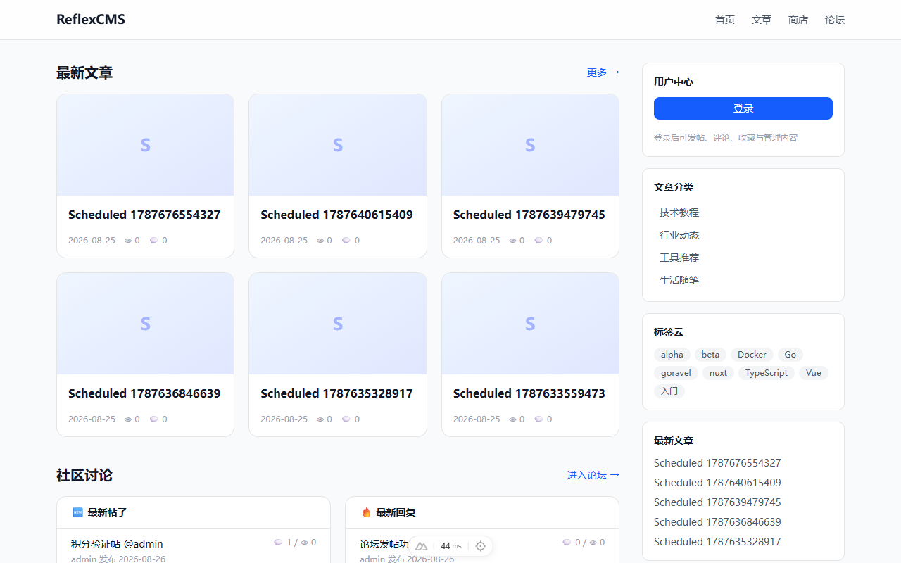
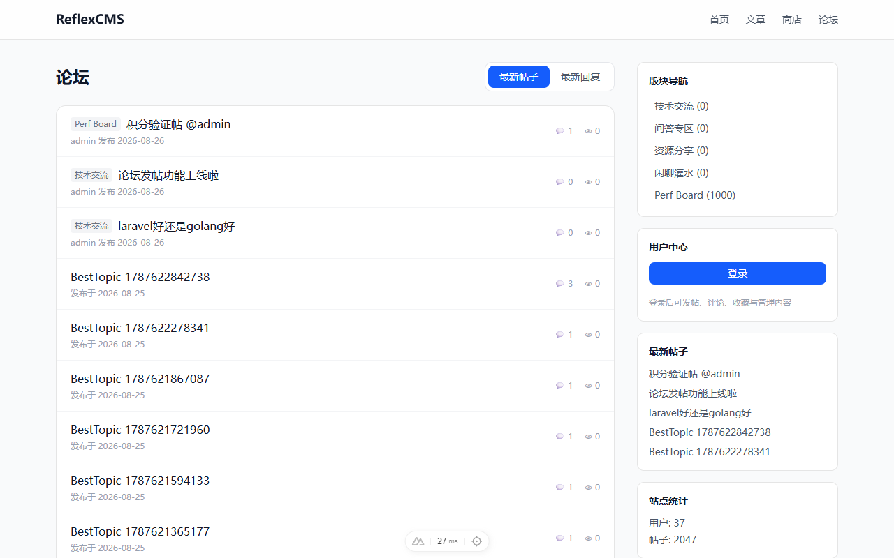
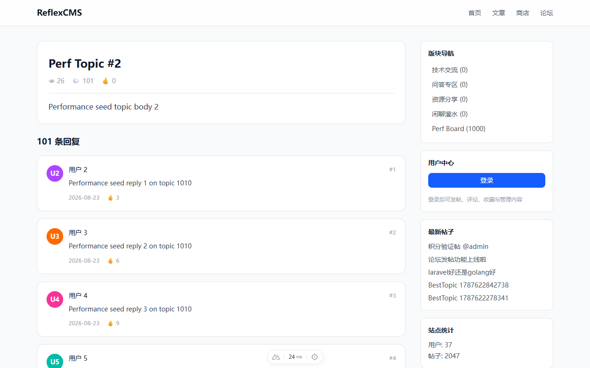
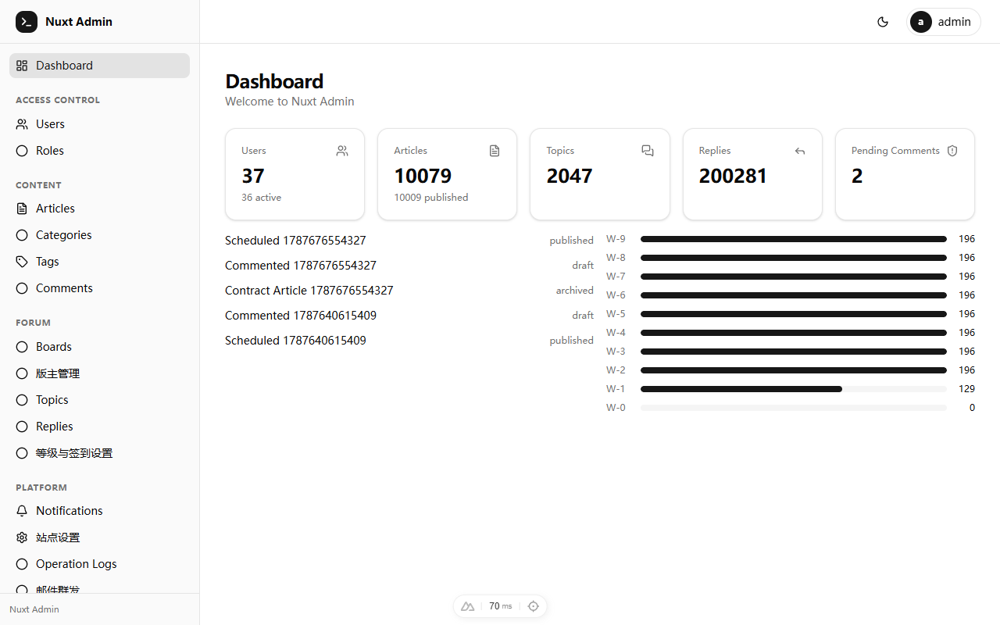
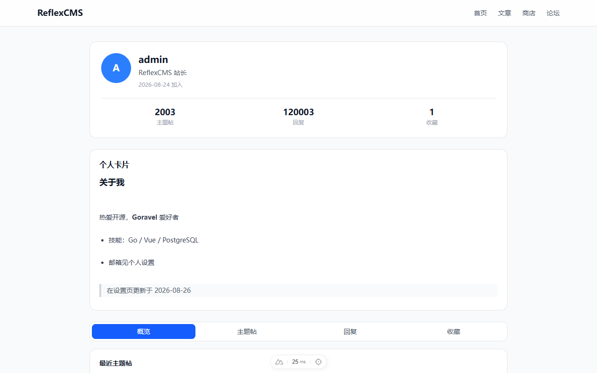
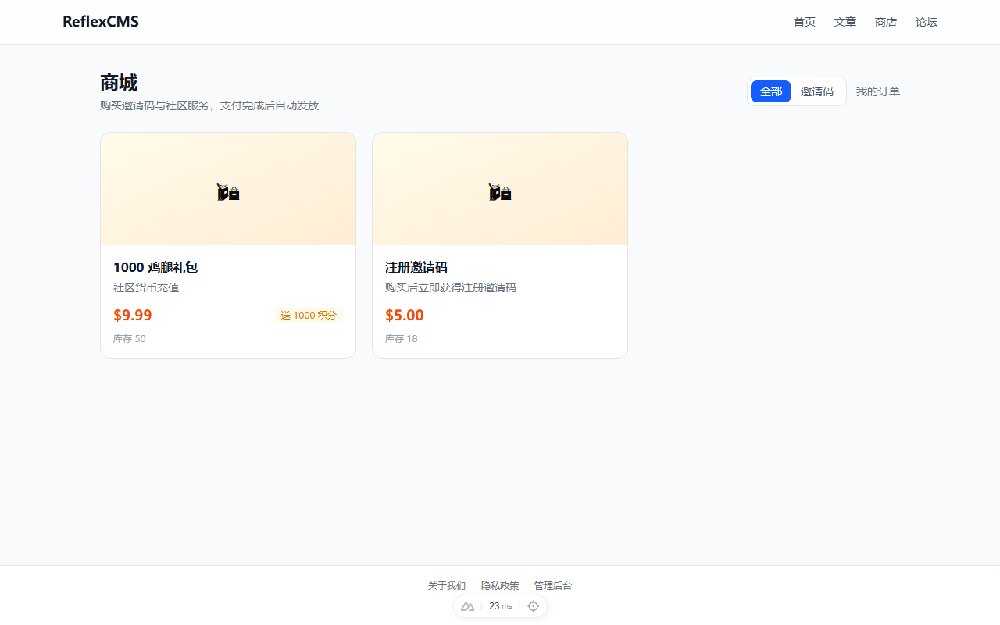

# ReflexCMS · 可自部署的开源 CMS + 社区论坛

> 基于 **Goravel v1.18（Go）** 与 **Nuxt 4 / Vue 3** 构建的一体化内容与社区平台。支持 `CMS 文章`、`论坛社区`、`混合模式` 三种运行形态，内置**积分等级、签到、@提及、私信、拉黑、商城支付、静态页面管理**等完整社区能力。

[English](README.en.md) | 中文

## 📷 界面预览

| 首页（混合模式） | 论坛 |
|---|---|
|  |  |
| **帖子详情** | **管理后台** |
|  |  |
| **用户中心** | **商城** |
|  |  |

---

## ✨ 功能总览

### 内容管理（CMS）
- 文章发布：草稿 / 已发布 / 已归档，定时发布，SEO 元信息
- 分类 / 标签体系，中文分词全文检索（unigram + PG fulltext）
- 封面图、浏览量缓存、文章收藏、评论（审核制 + @提及）

### 论坛社区（Forum）
- 版块管理、主题帖 / 回复 / 楼层号、置顶 / 精华 / 关闭 / 最佳回复
- **发帖**：板块选择 + Markdown 编辑器 + 发帖积分奖励
- 回复分页、@提及通知、拉黑屏蔽、**版主体系**（板块级任命 + 禁言/封禁治理）
- **邀请制注册**：后台一键开启，邀请码可在商城购买，支付后自动发放

### 用户与激励
- 会话鉴权（不透明 token）、RBAC 角色权限 + 可视化权限编辑器
- **积分等级**：货币名称、发帖/回复/签到奖励、每日上限、升级阈值全部后台可配
- 用户中心卡片：等级进度条、今日任务、货币余额、六项计数
- 用户公开主页（概览/主题帖/回复/收藏）+ Markdown 个人卡片 + 回复签名
- **私信**：Markdown 编辑、收件箱/已发送、未读计数

### 平台与扩展
- **商城与支付网关插件**：Xcash / NOWPayments / CoinPayments / PayPal 已实现；虎皮椒 / 码支付（MD5 协议）已内置，启用需安全策略例外
- **静态页面管理**：内置 WYSIWYG 富文本编辑器，前台 `/p/{slug}` 展示（隐私政策 / TOS 等）
- 布局管理：侧栏卡片可视化配置、页眉/页脚导航、轮播图
- 站点三种模式运行时切换：`CMS` / `Forum` / `Hybrid`
- 邮件群发（单发/批量导入）、审计日志、多语言（简中 / English）

---

## 🚀 一键部署

```bash
git clone https://github.com/polibee/reflexcms.git
cd reflexcms
./deploy/deploy.sh
```

脚本自动完成：环境检查 → Docker 启动 PostgreSQL 17 + Redis 7 → 数据库迁移与种子 → 超级管理员账号引导 → 后端构建 → 前端构建。完成后访问 `http://localhost:3000`。

> **生产环境管理员账号**：部署脚本会在全新安装时运行 `artisan admin:bootstrap`，自动生成强随机密码并**只打印一次**，请立即保存。也可手动执行（在 `backend/` 目录）`go run . artisan admin:bootstrap --email=you@example.com`（省略 `--password` 则自动生成）。空站点上首次注册的账号同样会被授予超级管理员。管理员可在后台「个人设置」中随时修改密码。开发环境默认账号仍为 `admin@reflexcms.dev` / `ReflexCMS@2026`，上线前务必重置。

手动部署与生产环境配置见 [`docs/运维部署手册.md`](docs/运维部署手册.md)。

---

## 🧱 技术架构

**后端**：Goravel v1.18（Go ≥ 1.25）· gin · gorm/pgx · PostgreSQL 17 · Redis 7
**前端**：Nuxt 4 · Vue 3.5 · TanStack Table · VeeValidate + Zod · BFF 代理

- **模块化产品组合**：`products` 层是唯一知晓所有模块的组装点，可组合出 `Full / Blog / Forum` 三种可独立部署的产品
- 通用资源网关 `adminhub`：声明式 Spec 驱动全后台 CRUD
- 支付网关插件化：`gateways.Gateway` 接口 + 自注册，新渠道即插即用
- 自研零依赖安全 Markdown 渲染器（先转义后转换，免疫 XSS）
- 中文全文检索（unigram 分词）、SSRF 防护、全量参数绑定

---

## 📈 开发进度

| 阶段 | 内容 | 状态 |
|---|---|---|
| M0 | 平台底座、模块化骨架、BFF | ✅ |
| M1 | 认证 + RBAC + 通用资源网关 | ✅ |
| M2 | CMS：文章/分类/标签、CJK 搜索、定时发布 | ✅ |
| M3 | Forum：版块/主题/回复/点赞、楼层事务、最佳回复 | ✅ |
| M4 | 评论审核、通知、积分、邀请码 | ✅ |
| M5 | 限流、锁定、SSRF 防护、审计日志、CI | ✅ |
| 公共前台 | 模式化首页、文章卡片、论坛双列表、发帖回复 | ✅ |
| 用户体系 | 用户主页、个人卡片、积分等级、签到、私信 | ✅ |
| 社区治理 | 版主体系、禁言/封禁、拉黑、@提及、通知中心 | ✅ |
| 商城支付 | 商品/订单/库存、5 支付网关插件、邀请码商品 | ✅ |
| 页面管理 | 静态页面 + WYSIWYG 富文本编辑器 | ✅ |
| 平台化 | 多语言（zh-CN / en）、部署脚本、邮件群发 | ✅ |

**规划中**：Meilisearch 搜索增强、OAuth 登录、主题层分离。

---

## 📚 文档

- [`docs/工程化开发计划.md`](docs/工程化开发计划.md) — 总计划：架构决策、接口契约、里程碑
- [`docs/模块化架构与产品组合.md`](docs/模块化架构与产品组合.md) — 模块边界与产品组合
- [`docs/积分与邀请系统.md`](docs/积分与邀请系统.md) — 激励与等级设计
- [`docs/运维部署手册.md`](docs/运维部署手册.md) — 部署运维

---

<a id="vast-ai"></a>
## ☁️ 需要 GPU 算力？

**[Vast — 高性价比 GPU 云租用](https://cloud.vast.ai/?ref_id=91181)**：如果你需要为 AI 摘要、内容审核等模块准备 GPU 算力，推荐试试 [Vast](https://cloud.vast.ai/?ref_id=91181)——按时计费、海量社区 GPU、价格仅为主流云的零头。

- **全球最大 GPU 共享市场**：20,000+ 可租 GPU、40+ 数据中心，覆盖 RTX 4090 / A100 / H100 等主流卡型
- **按秒计费，随用随停**：价格由供需实时决定，通常只有传统云厂商的几分之一；充几美元就能开跑
- **分钟级部署**：选择 PyTorch / TensorFlow 等镜像，一键启动实例，SSH / Jupyter 直连
- **多种租用形态**：单卡实例、大规模弹性集群、Serverless 推理端点，按需选择

## 📄 License

MIT
